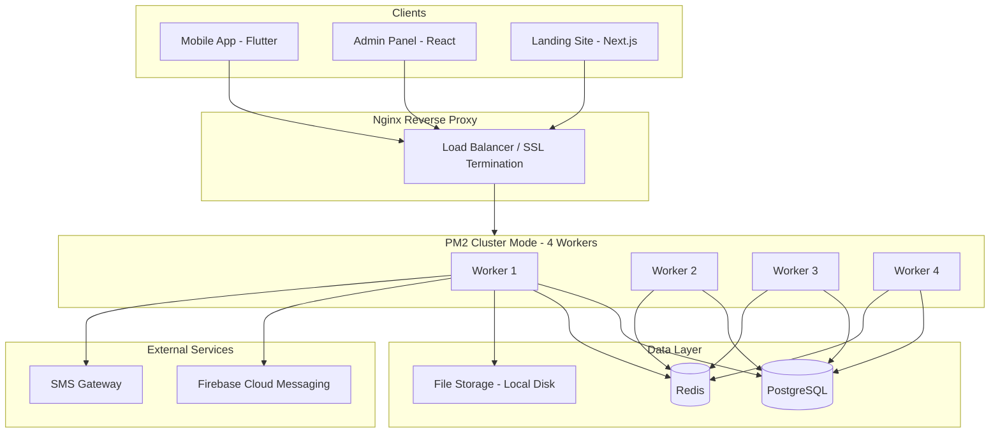
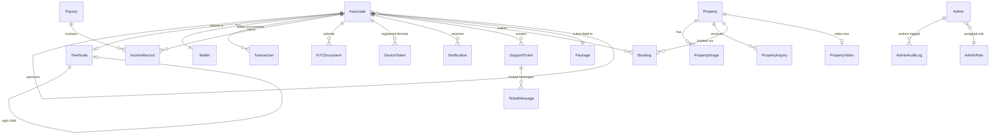

# Design Document: Investors World Realty Platform

## Overview

Investors World Realty is a full-stack MLM real estate platform enabling associates to join under sponsors, build binary tree teams, earn multi-type commissions, and facilitate property sales. The system is composed of four main applications sharing a single backend API:

- **API Server** (Node.js + Express + Prisma + PostgreSQL) — core business logic, authentication, MLM engine, wallet, notifications
- **Admin Panel** (React + Vite + Tailwind CSS) — multi-role admin interface for platform management
- **Landing Site** (Next.js + Tailwind CSS) — public-facing marketing and property showcase
- **Mobile App** (Flutter) — associate-facing app consuming the same APIs

The platform must support 5000 concurrent active users with sub-500ms p95 response times, running on a single Hostinger VPS KVM 4 (4 vCPU, 8GB RAM, 200GB SSD) with PM2 cluster mode and Nginx reverse proxy.

## Architecture

### High-Level System Architecture



### Backend Architecture (Layered)

```mermaid
graph LR
    subgraph Routes[Route Layer]
        R1[Auth Routes]
        R2[Associate Routes]
        R3[Admin Routes]
        R4[Property Routes]
        R5[Wallet Routes]
        R6[Notification Routes]
    end

    subgraph Middleware[Middleware Layer]
        M1[Auth Middleware]
        M2[Role Guard]
        M3[Rate Limiter]
        M4[Validator]
        M5[Error Handler]
    end

    subgraph Services[Service Layer]
        S1[Auth Service]
        S2[MLM Service]
        S3[Wallet Service]
        S4[Payout Service]
        S5[Property Service]
        S6[Notification Service]
        S7[Document Service]
        S8[Report Service]
    end

    subgraph Data[Data Access Layer]
        D1[Prisma Client]
        D2[Redis Client]
        D3[File Manager]
    end

    Routes --> Middleware
    Middleware --> Services
    Services --> Data
```



### Key Architectural Decisions

| Decision | Choice | Rationale |
|----------|--------|-----------|
| ORM | Prisma | Type-safe queries, migrations, schema-first approach |
| Session/Cache | Redis | Fast OTP storage, rate limiting, dashboard caching |
| Auth | JWT + Refresh Tokens | Stateless auth suitable for mobile + web clients |
| File Storage | Local disk (VPS) | Cost-effective for single-server deployment, served via Nginx |
| Push Notifications | Firebase Cloud Messaging | Industry standard, supports topics, multi-device |
| Process Manager | PM2 Cluster | Utilizes all 4 CPU cores, zero-downtime restarts |
| API Versioning | URL prefix `/api/v1` | Clear versioning for mobile app compatibility |
| Soft Delete | `deletedAt` timestamp | Preserves audit history, allows recovery |

## Components and Interfaces

### API Server Modules

#### 1. Authentication Module (`/api/v1/auth`)

| Endpoint | Method | Description |
|----------|--------|-------------|
| `/login` | POST | Authenticate with User ID + password, return JWT + refresh token |
| `/refresh` | POST | Exchange refresh token for new access token |
| `/logout` | POST | Invalidate tokens, remove device token |
| `/forgot-password` | POST | Send OTP to registered phone/email |
| `/reset-password` | POST | Validate OTP and set new password |
| `/change-password` | POST | Change password with current password validation |

#### 2. Associate Module (`/api/v1/associate`)

| Endpoint | Method | Description |
|----------|--------|-------------|
| `/dashboard` | GET | Return dashboard metrics |
| `/profile` | GET | Return associate profile |
| `/profile` | PATCH | Update editable profile fields |
| `/profile/photo` | POST | Upload profile photo |
| `/kyc/pan` | POST | Submit PAN card details + document |
| `/kyc/aadhaar` | POST | Submit Aadhaar details + document |
| `/kyc/bank` | POST | Submit bank details |
| `/referral-link` | GET | Get referral URL |
| `/referral-qr` | GET | Get referral QR code image |
| `/settings` | GET/PATCH | Get/update preferences (theme, language) |

#### 3. Registration Module (`/api/v1/registration`)

| Endpoint | Method | Description |
|----------|--------|-------------|
| `/register` | POST | Register new associate under sponsor |
| `/validate-sponsor` | GET | Validate sponsor ID exists and is active |
| `/activate` | POST | Activate associate with package payment |

#### 4. Genealogy Module (`/api/v1/genealogy`)

| Endpoint | Method | Description |
|----------|--------|-------------|
| `/tree` | GET | Get binary tree from associate's position |
| `/downline` | GET | Get paginated downline list |
| `/sponsor` | GET | Get sponsor details |
| `/team-summary` | GET | Get left/right leg business volume |

#### 5. Wallet Module (`/api/v1/wallet`)

| Endpoint | Method | Description |
|----------|--------|-------------|
| `/balance` | GET | Get wallet balance, credits, debits |
| `/transfer` | POST | Transfer funds to another associate |
| `/transactions` | GET | Get paginated transaction history |
| `/withdraw` | POST | Request withdrawal |
| `/withdrawals` | GET | Get withdrawal history |

#### 6. Income Module (`/api/v1/income`)

| Endpoint | Method | Description |
|----------|--------|-------------|
| `/summary` | GET | Get income breakdown by type |
| `/history` | GET | Get paginated income transactions |
| `/calculator` | POST | Calculate projected commissions |

#### 7. Property Module (`/api/v1/properties`)

| Endpoint | Method | Description |
|----------|--------|-------------|
| `/` | GET | List properties with filters + pagination |
| `/:id` | GET | Get property details |
| `/:id/inquiry` | POST | Submit property inquiry |
| `/:id/book` | POST | Initiate property booking |
| `/bookings` | GET | Get associate's booking history |
| `/emi-calculator` | POST | Calculate EMI |

#### 8. Notification Module (`/api/v1/notifications`)

| Endpoint | Method | Description |
|----------|--------|-------------|
| `/` | GET | Get paginated notification history |
| `/:id/read` | PATCH | Mark notification as read |
| `/device-token` | POST | Register device token |
| `/device-token` | DELETE | Remove device token |

#### 9. Document Module (`/api/v1/documents`)

| Endpoint | Method | Description |
|----------|--------|-------------|
| `/welcome-letter` | GET | Generate and download welcome letter PDF |
| `/receipt/:transactionId` | GET | Generate and download payment receipt PDF |
| `/agreement` | GET | Generate and download agreement PDF |
| `/kyc` | GET | Get KYC document URLs |

#### 10. Support Module (`/api/v1/support`)

| Endpoint | Method | Description |
|----------|--------|-------------|
| `/tickets` | GET | List associate's tickets |
| `/tickets` | POST | Create new ticket |
| `/tickets/:id` | GET | Get ticket with thread |
| `/tickets/:id/reply` | POST | Add reply to ticket |

#### 11. Admin Module (`/api/v1/admin`)

Sub-routes for dashboard, associates, genealogy, payouts, reports, funds, properties, notifications, KYC, master config, transactions, and app version management.

#### 12. Public Module (`/api/v1/public`)

| Endpoint | Method | Description |
|----------|--------|-------------|
| `/properties` | GET | Public property listings |
| `/contact` | POST | Submit contact form |
| `/emi-calculator` | POST | Public EMI calculator |
| `/commission-calculator` | POST | Public commission calculator |
| `/app-version` | GET | Get app version info |
| `/branding` | GET | Get branding assets |
| `/health` | GET | Health check |

### Middleware Stack

```
Request → Nginx (SSL, static files, rate limit L1)
       → Express App
       → Helmet (security headers)
       → CORS
       → Body Parser (JSON + multipart)
       → Request Logger (morgan)
       → Rate Limiter (Redis-backed)
       → Auth Middleware (JWT verification)
       → Role Guard (permission check)
       → Input Validator (express-validator / Joi)
       → Route Handler
       → Error Handler (centralized)
```

### Service Interfaces

```typescript
// Auth Service
interface AuthService {
  login(userId: string, password: string): Promise<{ accessToken, refreshToken, user }>
  refresh(refreshToken: string): Promise<{ accessToken }>
  logout(userId: string, deviceToken?: string): Promise<void>
  sendOtp(identifier: string): Promise<void>
  verifyOtp(identifier: string, otp: string): Promise<boolean>
  resetPassword(identifier: string, otp: string, newPassword: string): Promise<void>
  changePassword(userId: string, currentPassword: string, newPassword: string): Promise<void>
}

// MLM Service (Binary Tree + Commission Engine)
interface MLMService {
  placeAssociate(sponsorId: string, leg: 'left' | 'right', associateId: string): Promise<TreeNode>
  findNextAvailablePosition(sponsorId: string, leg: 'left' | 'right'): Promise<TreePosition>
  getTree(rootId: string, depth: number): Promise<TreeNode>
  getDownline(associateId: string, filters: DownlineFilters): Promise<PaginatedResult<Associate>>
  calculateDirectIncome(sponsorId: string, packageId: string): Promise<IncomeRecord>
  calculateLevelIncome(associateId: string): Promise<IncomeRecord[]>
  calculateMatchingIncome(associateId: string): Promise<IncomeRecord>
  calculateRewardIncome(associateId: string): Promise<IncomeRecord | null>
  getTeamSummary(associateId: string): Promise<{ leftVolume, rightVolume }>
}

// Wallet Service
interface WalletService {
  getBalance(associateId: string): Promise<WalletBalance>
  credit(associateId: string, amount: number, type: string, description: string): Promise<Transaction>
  debit(associateId: string, amount: number, type: string, description: string): Promise<Transaction>
  transfer(senderId: string, recipientId: string, amount: number): Promise<{ senderTx, recipientTx }>
  getTransactions(associateId: string, filters: TxFilters): Promise<PaginatedResult<Transaction>>
}

// Notification Service
interface NotificationService {
  registerDevice(associateId: string, token: string, platform: string): Promise<void>
  removeDevice(associateId: string, token: string): Promise<void>
  sendToAssociate(associateId: string, notification: NotificationPayload): Promise<void>
  sendToTopic(topic: string, notification: NotificationPayload): Promise<void>
  sendBulk(associateIds: string[], notification: NotificationPayload): Promise<void>
}
```


## Data Models

### Core Entity Relationship Diagram



### Prisma Schema (Key Models)

```prisma
model Associate {
  id              String    @id @default(uuid())
  userId          String    @unique // IW100001 format
  name            String
  email           String    @unique
  phone           String    @unique
  password        String    // bcrypt hashed
  dateOfBirth     DateTime?
  address         String?
  city            String?
  state           String?
  pincode         String?
  panNumber       String?
  profilePhoto    String?   // file path
  
  sponsorId       String?
  sponsor         Associate?  @relation("Sponsorship", fields: [sponsorId], references: [id])
  sponsored       Associate[] @relation("Sponsorship")
  
  packageId       String?
  package         Package?    @relation(fields: [packageId], references: [id])
  
  status          AssociateStatus @default(INACTIVE)
  joiningDate     DateTime    @default(now())
  activationDate  DateTime?
  
  // Preferences
  theme           String    @default("light")
  language        String    @default("en")
  
  // Security
  failedAttempts  Int       @default(0)
  lockedUntil     DateTime?
  
  // Soft delete
  deletedAt       DateTime?
  
  // Relations
  wallet          Wallet?
  treeNode        TreeNode?
  kycDocuments    KYCDocument[]
  deviceTokens    DeviceToken[]
  notifications   Notification[]
  incomeRecords   IncomeRecord[]
  supportTickets  SupportTicket[]
  bookings        Booking[]
  
  createdAt       DateTime  @default(now())
  updatedAt       DateTime  @updatedAt

  @@index([sponsorId])
  @@index([status])
  @@index([deletedAt])
}

enum AssociateStatus {
  INACTIVE
  ACTIVE
  SUSPENDED
  RED
}

model TreeNode {
  id            String    @id @default(uuid())
  associateId   String    @unique
  associate     Associate @relation(fields: [associateId], references: [id])
  
  parentId      String?
  parent        TreeNode? @relation("TreeHierarchy", fields: [parentId], references: [id])
  children      TreeNode[] @relation("TreeHierarchy")
  
  position      LegPosition // LEFT or RIGHT under parent
  level         Int       // depth in tree (root = 0)
  
  leftChildId   String?   @unique
  rightChildId  String?   @unique
  
  // Business volume tracking
  leftVolume    Decimal   @default(0)
  rightVolume   Decimal   @default(0)
  carryForward  Decimal   @default(0)
  
  createdAt     DateTime  @default(now())
  updatedAt     DateTime  @updatedAt

  @@index([parentId])
  @@index([level])
}

enum LegPosition {
  LEFT
  RIGHT
}

model Wallet {
  id            String    @id @default(uuid())
  associateId   String    @unique
  associate     Associate @relation(fields: [associateId], references: [id])
  
  balance       Decimal   @default(0)
  totalCredits  Decimal   @default(0)
  totalDebits   Decimal   @default(0)
  
  transactions  Transaction[]
  
  createdAt     DateTime  @default(now())
  updatedAt     DateTime  @updatedAt
}

model Transaction {
  id            String    @id @default(uuid())
  walletId      String
  wallet        Wallet    @relation(fields: [walletId], references: [id])
  
  type          TransactionType
  amount        Decimal
  balanceAfter  Decimal
  description   String
  reference     String?   // counterparty userId or system reference
  
  status        TransactionStatus @default(COMPLETED)
  
  // For admin-initiated transactions
  adminId       String?
  adminReason   String?
  
  createdAt     DateTime  @default(now())

  @@index([walletId])
  @@index([type])
  @@index([createdAt])
}

enum TransactionType {
  DIRECT_INCOME
  LEVEL_INCOME
  MATCHING_INCOME
  REWARD_INCOME
  FUND_TRANSFER_IN
  FUND_TRANSFER_OUT
  WITHDRAWAL
  ADMIN_CREDIT
  ADMIN_DEBIT
  PACKAGE_PURCHASE
  BOOKING_PAYMENT
}

enum TransactionStatus {
  PENDING
  COMPLETED
  FAILED
  REVERSED
}

model Package {
  id              String    @id @default(uuid())
  name            String
  price           Decimal
  benefits        Json      // array of benefit descriptions
  directPercent   Decimal   // direct income percentage
  isActive        Boolean   @default(true)
  
  associates      Associate[]
  
  createdAt       DateTime  @default(now())
  updatedAt       DateTime  @updatedAt
}

model IncomePlan {
  id              String    @id @default(uuid())
  type            IncomeType
  level           Int?      // for level income
  percentage      Decimal
  minPairVolume   Decimal?  // for matching income
  milestone       Decimal?  // for reward income
  rewardAmount    Decimal?  // for reward income
  isActive        Boolean   @default(true)
  
  createdAt       DateTime  @default(now())
  updatedAt       DateTime  @updatedAt
}

enum IncomeType {
  DIRECT
  LEVEL
  MATCHING
  REWARD
}

model IncomeRecord {
  id            String    @id @default(uuid())
  associateId   String
  associate     Associate @relation(fields: [associateId], references: [id])
  
  type          IncomeType
  amount        Decimal
  sourceId      String?   // associate who triggered this income
  payoutId      String?
  payout        Payout?   @relation(fields: [payoutId], references: [id])
  
  status        IncomeStatus @default(PENDING)
  
  createdAt     DateTime  @default(now())

  @@index([associateId])
  @@index([type])
  @@index([status])
  @@index([createdAt])
}

enum IncomeStatus {
  PENDING
  APPROVED
  PAID
  REJECTED
}

model Payout {
  id            String    @id @default(uuid())
  totalAmount   Decimal
  status        PayoutStatus @default(PENDING)
  approvedBy    String?
  rejectedReason String?
  
  incomeRecords IncomeRecord[]
  
  createdAt     DateTime  @default(now())
  updatedAt     DateTime  @updatedAt
}

enum PayoutStatus {
  PENDING
  APPROVED
  REJECTED
  PAID
}

model Property {
  id            String    @id @default(uuid())
  name          String
  description   String
  location      String
  city          String
  state         String
  area          Decimal   // in sq ft
  price         Decimal
  type          String    // villa, plot, apartment, etc.
  amenities     Json      // array of amenity strings
  status        PropertyStatus @default(AVAILABLE)
  isFeatured    Boolean   @default(false)
  
  images        PropertyImage[]
  videos        PropertyVideo[]
  inquiries     PropertyInquiry[]
  bookings      Booking[]
  
  deletedAt     DateTime?
  createdAt     DateTime  @default(now())
  updatedAt     DateTime  @updatedAt

  @@index([status])
  @@index([city])
  @@index([type])
  @@index([deletedAt])
}

enum PropertyStatus {
  AVAILABLE
  BOOKED
  SOLD
}

model PropertyImage {
  id          String    @id @default(uuid())
  propertyId  String
  property    Property  @relation(fields: [propertyId], references: [id])
  url         String
  sortOrder   Int       @default(0)
  createdAt   DateTime  @default(now())

  @@index([propertyId])
}

model PropertyVideo {
  id          String    @id @default(uuid())
  propertyId  String
  property    Property  @relation(fields: [propertyId], references: [id])
  url         String
  format      String    @default("mp4")
  createdAt   DateTime  @default(now())

  @@index([propertyId])
}

model Booking {
  id            String    @id @default(uuid())
  associateId   String
  associate     Associate @relation(fields: [associateId], references: [id])
  propertyId    String
  property      Property  @relation(fields: [propertyId], references: [id])
  
  amount        Decimal
  status        BookingStatus @default(PENDING)
  receiptUrl    String?
  
  createdAt     DateTime  @default(now())
  updatedAt     DateTime  @updatedAt

  @@index([associateId])
  @@index([propertyId])
  @@index([status])
}

enum BookingStatus {
  PENDING
  CONFIRMED
  CANCELLED
}

model KYCDocument {
  id            String    @id @default(uuid())
  associateId   String
  associate     Associate @relation(fields: [associateId], references: [id])
  
  type          KYCType
  documentNumber String
  documentUrl   String    // file path
  status        KYCStatus @default(PENDING)
  rejectionReason String?
  verifiedBy    String?
  verifiedAt    DateTime?
  
  createdAt     DateTime  @default(now())
  updatedAt     DateTime  @updatedAt

  @@unique([associateId, type])
  @@index([status])
}

enum KYCType {
  PAN
  AADHAAR
  BANK
}

enum KYCStatus {
  PENDING
  APPROVED
  REJECTED
}

model DeviceToken {
  id            String    @id @default(uuid())
  associateId   String
  associate     Associate @relation(fields: [associateId], references: [id])
  
  token         String    @unique
  platform      String    // android, ios, web
  
  createdAt     DateTime  @default(now())

  @@index([associateId])
}

model Notification {
  id            String    @id @default(uuid())
  associateId   String
  associate     Associate @relation(fields: [associateId], references: [id])
  
  title         String
  message       String
  type          NotificationType
  isRead        Boolean   @default(false)
  data          Json?     // additional payload
  
  createdAt     DateTime  @default(now())

  @@index([associateId, isRead])
  @@index([createdAt])
}

enum NotificationType {
  PAYOUT
  REGISTRATION
  PROPERTY
  ANNOUNCEMENT
  INCOME
  KYC
  BOOKING
  SYSTEM
}

model SupportTicket {
  id            String    @id @default(uuid())
  ticketNumber  String    @unique // auto-generated
  associateId   String
  associate     Associate @relation(fields: [associateId], references: [id])
  
  subject       String
  status        TicketStatus @default(OPEN)
  
  messages      TicketMessage[]
  
  createdAt     DateTime  @default(now())
  updatedAt     DateTime  @updatedAt

  @@index([associateId])
  @@index([status])
}

enum TicketStatus {
  OPEN
  IN_PROGRESS
  RESOLVED
  CLOSED
}

model TicketMessage {
  id          String    @id @default(uuid())
  ticketId    String
  ticket      SupportTicket @relation(fields: [ticketId], references: [id])
  
  senderId    String    // associate or admin ID
  senderType  String    // "associate" or "admin"
  message     String
  
  createdAt   DateTime  @default(now())

  @@index([ticketId])
}

model Admin {
  id          String    @id @default(uuid())
  name        String
  email       String    @unique
  phone       String    @unique
  password    String    // bcrypt hashed
  roleId      String
  role        AdminRole @relation(fields: [roleId], references: [id])
  
  isActive    Boolean   @default(true)
  
  auditLogs   AdminAuditLog[]
  
  createdAt   DateTime  @default(now())
  updatedAt   DateTime  @updatedAt
}

model AdminRole {
  id          String    @id @default(uuid())
  name        String    @unique // Super Admin, Manager, Support, Accounts
  permissions Json      // array of permission strings
  
  admins      Admin[]
  
  createdAt   DateTime  @default(now())
  updatedAt   DateTime  @updatedAt
}

model AdminAuditLog {
  id          String    @id @default(uuid())
  adminId     String
  admin       Admin     @relation(fields: [adminId], references: [id])
  
  action      String
  entity      String
  entityId    String?
  details     Json?
  ipAddress   String?
  
  createdAt   DateTime  @default(now())

  @@index([adminId])
  @@index([entity, entityId])
  @@index([createdAt])
}

model WithdrawalRequest {
  id            String    @id @default(uuid())
  associateId   String
  amount        Decimal
  status        WithdrawalStatus @default(PENDING)
  transactionRef String?
  processedBy   String?
  processedAt   DateTime?
  rejectionReason String?
  
  createdAt     DateTime  @default(now())
  updatedAt     DateTime  @updatedAt

  @@index([associateId])
  @@index([status])
  @@index([createdAt])
}

enum WithdrawalStatus {
  PENDING
  APPROVED
  REJECTED
  PAID
}

model PropertyInquiry {
  id            String    @id @default(uuid())
  propertyId    String
  property      Property  @relation(fields: [propertyId], references: [id])
  associateId   String
  message       String
  
  createdAt     DateTime  @default(now())

  @@index([propertyId])
}

model ContactInquiry {
  id          String    @id @default(uuid())
  name        String
  email       String
  phone       String?
  message     String
  
  createdAt   DateTime  @default(now())
}

model AppVersion {
  id              String    @id @default(uuid())
  platform        String    // android, ios
  minVersion      String
  latestVersion   String
  storeUrl        String
  forceUpdate     Boolean   @default(false)
  
  updatedAt       DateTime  @updatedAt
}

model BrandingAsset {
  id          String    @id @default(uuid())
  key         String    @unique // logo, splash, etc.
  url         String
  
  updatedAt   DateTime  @updatedAt
}

model MasterState {
  id    String @id @default(uuid())
  name  String @unique
}

model MasterCity {
  id      String @id @default(uuid())
  name    String
  stateId String
  
  @@index([stateId])
}

model PropertyCategory {
  id    String @id @default(uuid())
  name  String @unique
}
```

### Redis Data Structures

| Key Pattern | Type | TTL | Purpose |
|-------------|------|-----|---------|
| `otp:{phone/email}` | String | 300s | OTP storage |
| `auth:blacklist:{token}` | String | Token remaining TTL | Invalidated tokens |
| `rate:{ip}:{endpoint}` | Counter | 60s | Rate limiting |
| `lock:{userId}` | String | 1800s | Account lockout |
| `cache:dashboard:{adminId}` | Hash | 60s | Admin dashboard metrics |
| `cache:packages` | String (JSON) | 3600s | Package list cache |
| `cache:properties:featured` | String (JSON) | 300s | Featured properties |
| `session:{refreshToken}` | String | 7d | Refresh token validation |


## Correctness Properties

*A property is a characteristic or behavior that should hold true across all valid executions of a system — essentially, a formal statement about what the system should do. Properties serve as the bridge between human-readable specifications and machine-verifiable correctness guarantees.*

### Property 1: Wallet Balance Invariant

*For any* Associate wallet, after any sequence of credit and debit operations, the wallet balance SHALL always equal totalCredits minus totalDebits, and the balance SHALL never become negative through normal operations.

**Validates: Requirements 2.3, 8.1, 8.5, 28.3**

### Property 2: Fund Transfer Conservation

*For any* fund transfer between two Associates, the total sum of both wallets' balances before the transfer SHALL equal the total sum after the transfer (funds are neither created nor destroyed).

**Validates: Requirements 8.2, 8.3**

### Property 3: Binary Tree Placement Correctness

*For any* new Associate registration with a specified leg preference (left/right), the Associate SHALL be placed in the correct leg of the binary tree — either directly under the sponsor if the position is available, or in the next available position in that leg via BFS spillover — and the resulting tree SHALL maintain the binary tree invariant (each node has at most 2 children).

**Validates: Requirements 7.3, 7.5**

### Property 4: EMI Calculation Correctness

*For any* valid principal amount P, annual interest rate R, and tenure N months, the calculated EMI SHALL equal P × r × (1+r)^n / ((1+r)^n - 1) where r = R/12/100, and the EMI schedule's sum of principal components SHALL equal P (within rounding tolerance), and the remaining balance after the final month SHALL be zero (within rounding tolerance).

**Validates: Requirements 32.1, 32.2, 32.4**

### Property 5: Commission Calculation Correctness

*For any* Associate activation with a Package, the Direct Income for the sponsor SHALL equal the package price multiplied by the configured direct income percentage. *For any* Associate at level N in the tree, Level Income SHALL equal the business volume multiplied by the configured level-N percentage. *For any* Associate, Matching Income SHALL be calculated on the minimum of left leg volume and right leg volume multiplied by the matching percentage.

**Validates: Requirements 6.6, 6.7, 6.8**

### Property 6: Reward Income Threshold

*For any* Associate with total business volume V and *for any* configured reward milestone M with reward amount A, the Associate SHALL receive Reward Income A if and only if V >= M.

**Validates: Requirements 6.9**

### Property 7: Team Filter Consistency

*For any* Associate's downline and *for any* combination of filters (status, leg, level), all returned team members SHALL satisfy every applied filter condition, and no member satisfying all conditions SHALL be excluded from the results.

**Validates: Requirements 4.4, 4.5, 4.6**

### Property 8: Property Filter Consistency

*For any* set of property filter criteria (location, price range, property type), all returned properties SHALL match every specified filter, and no property matching all filters SHALL be excluded.

**Validates: Requirements 5.5**

### Property 9: User ID Uniqueness and Format

*For any* number of Associate registrations, every generated User ID SHALL be unique and SHALL match the pattern `IW` followed by exactly 6 digits (e.g., IW100001), with sequential ordering.

**Validates: Requirements 7.2, 28.6**

### Property 10: Withdrawal Balance Guard

*For any* withdrawal request with amount A against a wallet with balance B, the request SHALL be accepted if and only if A <= B. If A > B, the request SHALL be rejected with an insufficient balance error.

**Validates: Requirements 6.3, 6.4**

### Property 11: Soft-Delete Exclusion

*For any* soft-deleted record (Associate, Property, or Transaction), the record SHALL NOT appear in standard list/search query results, but SHALL remain accessible via admin audit queries.

**Validates: Requirements 28.4, 19.5**

### Property 12: Restricted Field Immutability

*For any* Associate profile update request containing restricted fields (name, date of birth, sponsor ID, placement), those fields SHALL remain unchanged after the request is processed.

**Validates: Requirements 3.7**

### Property 13: Password Strength Enforcement

*For any* password change or reset request, the new password SHALL be accepted if and only if it contains at least 8 characters, at least 1 uppercase letter, at least 1 number, and at least 1 special character.

**Validates: Requirements 25.3**

### Property 14: Role-Based Access Control

*For any* admin with assigned role R and *for any* API endpoint E, the admin SHALL be granted access if and only if role R's permission set includes the permission required by endpoint E.

**Validates: Requirements 12.3, 12.4**

### Property 15: Rate Limiting Enforcement

*For any* IP address making requests to the API, once the request count exceeds the configured threshold (100/min public, 300/min authenticated) within the time window, all subsequent requests SHALL receive a 429 status code until the window resets.

**Validates: Requirements 27.3**

### Property 16: API Response Format Consistency

*For any* API endpoint response, the JSON body SHALL contain `status`, `message`, and `data` fields. *For any* list endpoint response, the body SHALL additionally contain pagination metadata with `currentPage`, `totalPages`, `totalItems`, and `pageSize` fields.

**Validates: Requirements 26.1, 26.5**

### Property 17: Page Size Bounds

*For any* list endpoint request with a `pageSize` parameter, if pageSize > 100 the effective page size SHALL be capped at 100, if pageSize is not provided the effective page size SHALL default to 20, and if pageSize < 1 the request SHALL be rejected.

**Validates: Requirements 27.6**

### Property 18: Error Response Safety

*For any* unhandled server error, the API response SHALL NOT contain stack traces, internal file paths, database query details, or any implementation-specific information. The response SHALL return a generic error message with a 500 status code.

**Validates: Requirements 27.9**

### Property 19: Income Summary Invariant

*For any* Associate, the total earnings reported in the income summary SHALL equal the sum of Direct_Income + Level_Income + Matching_Income + Reward_Income individual totals.

**Validates: Requirements 6.1**

### Property 20: Property Booking Availability Guard

*For any* property with status BOOKED or SOLD, any booking attempt SHALL be rejected with a "property unavailable" error. Only properties with status AVAILABLE SHALL accept new bookings.

**Validates: Requirements 31.4**

### Property 21: Tree Depth Constraint

*For any* tree view request with depth parameter D, the returned tree structure SHALL contain nodes only up to depth D from the root, and each node SHALL have at most 2 children (left and right).

**Validates: Requirements 4.1**

### Property 22: File Upload Validation

*For any* profile photo upload, the file SHALL be accepted if and only if the MIME type is image/jpeg or image/png AND the file size is less than or equal to 2MB. *For any* property image upload, the file SHALL be accepted if and only if the size is less than or equal to 5MB. *For any* video upload, the file SHALL be accepted if and only if the format is MP4 or MOV AND the size is less than or equal to 100MB.

**Validates: Requirements 2.7, 19.2, 33.4**

## Error Handling

### Error Response Strategy

All errors follow a consistent format:

```json
{
  "status": "error",
  "message": "Human-readable error description",
  "code": "ERROR_CODE",
  "data": null
}
```

### Error Categories

| Category | HTTP Status | Handling |
|----------|-------------|----------|
| Validation Error | 400 | Return field-specific error messages |
| Authentication Error | 401 | Generic "Invalid credentials" message |
| Authorization Error | 403 | "Insufficient permissions" |
| Not Found | 404 | "Resource not found" |
| Conflict | 409 | "Resource already exists" (duplicate phone/email) |
| Rate Limited | 429 | "Too many requests, try again later" |
| Server Error | 500 | Generic message, log full details internally |

### Critical Error Scenarios

1. **Wallet Transaction Failure**: If any step in a wallet operation fails, the entire transaction is rolled back via Prisma's `$transaction()`. No partial balance updates occur.

2. **Binary Tree Placement Failure**: If spillover placement fails (theoretically impossible in a binary tree with available slots), the registration is rolled back and the user is notified.

3. **FCM Delivery Failure**: Notification delivery failures are logged but do not block the triggering operation. Failed notifications are queued for retry (max 3 attempts with exponential backoff).

4. **File Upload Failure**: If file storage fails after validation, the operation returns an error and no database records are created/updated.

5. **PDF Generation Failure**: If PDF generation fails, return a 503 with a retry suggestion. Log the error for investigation.

6. **Redis Connection Failure**: If Redis is unavailable, rate limiting falls back to in-memory (per-worker) limiting. OTP operations fail gracefully with a "service temporarily unavailable" message.

7. **Database Connection Failure**: Health check endpoint reports degraded status. All operations return 503 until connection is restored.

### Logging Strategy

- **Request logs**: Method, URL, status code, response time (morgan)
- **Error logs**: Full stack trace, request body (sanitized), user context
- **Audit logs**: Admin actions stored in `AdminAuditLog` table
- **Security logs**: Failed auth attempts, rate limit hits, suspicious patterns
- Log levels: ERROR, WARN, INFO, DEBUG (configurable per environment)
- Production: ERROR + WARN to file, rotated daily, 30-day retention

## Testing Strategy

### Testing Approach

The platform uses a dual testing approach combining unit tests with property-based tests for comprehensive coverage:

- **Property-based tests** (using [fast-check](https://github.com/dubzzz/fast-check)): Verify universal correctness properties across randomly generated inputs. Minimum 100 iterations per property.
- **Unit tests** (using Jest): Verify specific examples, edge cases, and integration points.
- **Integration tests** (using Jest + Supertest): Verify API endpoint behavior with a test database.

### Property-Based Testing Configuration

- **Library**: fast-check (JavaScript/TypeScript PBT library)
- **Minimum iterations**: 100 per property test
- **Tag format**: `Feature: investors-world-platform, Property {number}: {property_text}`

### Test Organization

```
server/
├── tests/
│   ├── properties/          # Property-based tests
│   │   ├── wallet.property.test.js
│   │   ├── mlm-tree.property.test.js
│   │   ├── emi-calculator.property.test.js
│   │   ├── commission.property.test.js
│   │   ├── filters.property.test.js
│   │   ├── validation.property.test.js
│   │   └── api-format.property.test.js
│   ├── unit/                # Unit tests
│   │   ├── auth.test.js
│   │   ├── registration.test.js
│   │   ├── wallet.test.js
│   │   ├── payout.test.js
│   │   └── ...
│   ├── integration/         # API integration tests
│   │   ├── auth.integration.test.js
│   │   ├── associate.integration.test.js
│   │   ├── admin.integration.test.js
│   │   └── ...
│   └── helpers/
│       ├── generators.js    # fast-check arbitraries
│       ├── setup.js         # test DB setup/teardown
│       └── mocks.js         # FCM, SMS mocks
```

### Property Test Mapping

| Property | Test File | Key Generators |
|----------|-----------|----------------|
| 1: Wallet Balance Invariant | wallet.property.test.js | Random credit/debit sequences |
| 2: Fund Transfer Conservation | wallet.property.test.js | Random transfer amounts, wallet pairs |
| 3: Binary Tree Placement | mlm-tree.property.test.js | Random trees, placement requests |
| 4: EMI Calculation | emi-calculator.property.test.js | Random principal, rate, tenure |
| 5: Commission Calculation | commission.property.test.js | Random packages, percentages |
| 6: Reward Income Threshold | commission.property.test.js | Random volumes, milestones |
| 7: Team Filter Consistency | filters.property.test.js | Random teams, filter combos |
| 8: Property Filter Consistency | filters.property.test.js | Random properties, filter combos |
| 9: User ID Format | validation.property.test.js | Sequential registrations |
| 10: Withdrawal Balance Guard | wallet.property.test.js | Random amounts vs balances |
| 11: Soft-Delete Exclusion | filters.property.test.js | Random records, delete operations |
| 12: Restricted Field Immutability | validation.property.test.js | Random field update attempts |
| 13: Password Strength | validation.property.test.js | Random strings |
| 14: Role-Based Access | validation.property.test.js | Random roles, endpoints |
| 15: Rate Limiting | api-format.property.test.js | Burst request sequences |
| 16: API Response Format | api-format.property.test.js | Random endpoint responses |
| 17: Page Size Bounds | api-format.property.test.js | Random pageSize values |
| 18: Error Response Safety | api-format.property.test.js | Random error triggers |
| 19: Income Summary Invariant | commission.property.test.js | Random income records |
| 20: Property Booking Guard | filters.property.test.js | Random property statuses |
| 21: Tree Depth Constraint | mlm-tree.property.test.js | Random trees, depth params |
| 22: File Upload Validation | validation.property.test.js | Random file metadata |

### Unit Test Focus Areas

- Authentication flow (login, OTP, lockout, token refresh)
- Registration validation (required fields, duplicate checks)
- KYC status transitions (pending → approved/rejected)
- Booking status transitions (pending → confirmed/cancelled)
- Support ticket lifecycle (open → in-progress → resolved → closed)
- Admin CRUD operations
- PDF generation content verification
- Notification payload construction

### Integration Test Focus Areas

- Full API endpoint request/response cycles
- Database transaction isolation
- Redis caching behavior
- File upload/download flows
- Pagination across all list endpoints
- Error response format verification
- Authentication middleware chain

### Performance Testing

- Load test with k6 or Artillery targeting 5000 concurrent users
- Key metrics: p95 response time < 500ms, error rate < 1%
- Focus endpoints: dashboard, tree view, wallet operations
